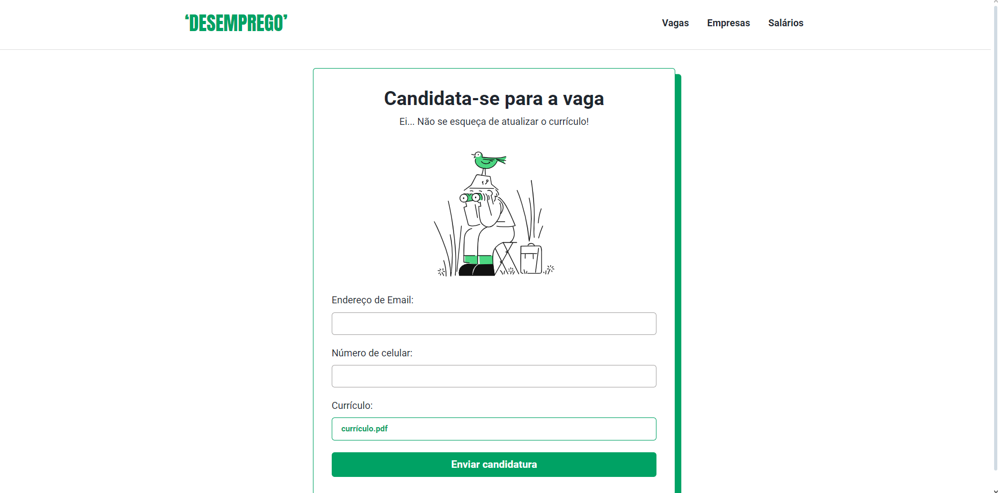

  

#

### Olá, sou a Letícia!👋
### 📍Cursando ensino superior em Sistemas para Internet
> Estou constantemente atualizando meus conhecimentos e buscando novos desafios na área de tecnologia. Tenho paixão por aprender e aplicar esses conhecimentos para criar soluções inovadoras.

 

 
          
          
            
            
          
          
          
          
          
          

          

 

#

### 🌍 Connect with me:

#

### 💻 Some projects:

<table>
  <tr>
    <th>📍Site do meu portfólio</th>
    <th>👩‍💻Sistema administrativo de uma empresa de jogos</th>
  </tr>
  <tr>
    <td></td>
    <td></td>
  </tr>
  <tr>
    <th>🛍️ Loja online de produtos em React</th>
    <th>🎮Landing Page da página do GTA</th>
  </tr>
  <tr>
   <td></td>
    <td></td>
  </tr>
  <tr>
    <th>💼API de vagas de emprego</th>
  </tr>
  <tr>
     <td></td>
  </tr>
</table>

#

<picture align="center">
  <source media="(prefers-color-scheme: dark)" srcset="https://raw.githubusercontent.com/LeticiaOk/LeticiaOk/output/github-contribution-grid-snake-dark.svg">
  <source media="(prefers-color-scheme: light)" srcset="https://raw.githubusercontent.com/LeticiaOk/LeticiaOk/output/github-contribution-grid-snake-dark.svg">
  
</picture>
