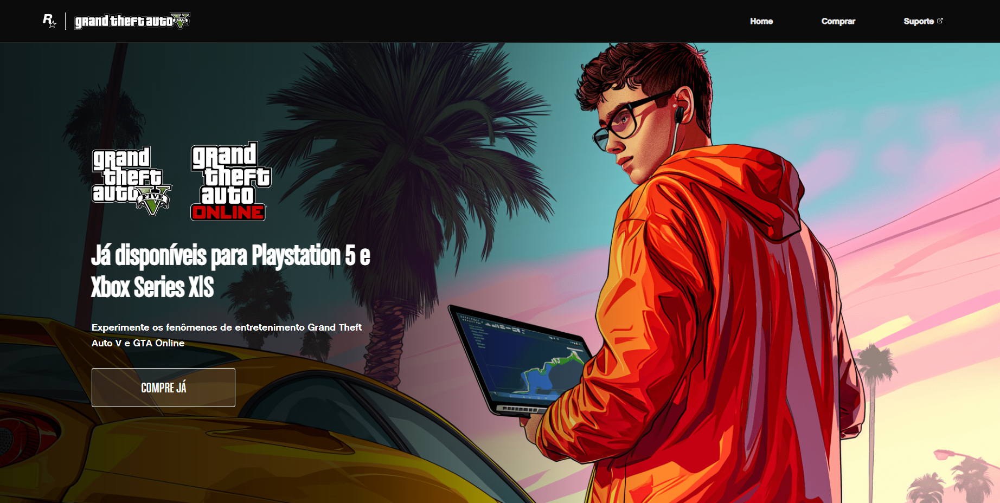

  

#

### Olá, sou a Letícia!👋
### 📍 Cursando ensino superior em Sistemas para Internet
> Estudante do 5º período, com experiência em projetos web (React e APIs) e em desenvolvimento Android com Kotlin. Possuo certificações em Python e SQL Server, e atualmente foco meus estudos e atuação na área de dados.
> 

 

 
          
          
            
            
          
          
          
          
          
          

          

 

#

### 🌍 Connect with me:

#

### 🚀 Projetos desenvolvidos por mim:

<table>
  <tr>
    <th>📍 Site do meu portfólio</th>
    <th>👩‍💻 Sistema administrativo</th>
  </tr>
  <tr>
    <td></td>
    <td></td>
  </tr>
  <tr>
    <th>📦Aplicativo de gestão de estoque</th>
    <th>🛍️ Loja online de produtos em React</th>
  </tr>
  <tr>
    <td></td>
   <td></td>  
  </tr>
  <tr>
    <th>🃏 Jogo de cartas em Python</th>
  </tr>
  <tr>
    <td></td>
  </tr>
</table>

### 📒 Projetos de imersão:

<table>
  <tr>
    <th>🎮 Landing Page da página do GTA</th>
     <th>☕ Ballecoffee</th>
     <th>🎷 Tom's Jazz School</th>
  </tr>
  <tr>
    <td></td>
    <td></td>
     <td></td>
  </tr>
</table>

#

<picture align="center">
  <source media="(prefers-color-scheme: dark)" srcset="https://raw.githubusercontent.com/LeticiaOk/LeticiaOk/output/github-contribution-grid-snake-dark.svg">
  <source media="(prefers-color-scheme: light)" srcset="https://raw.githubusercontent.com/LeticiaOk/LeticiaOk/output/github-contribution-grid-snake-dark.svg">
  
</picture>
